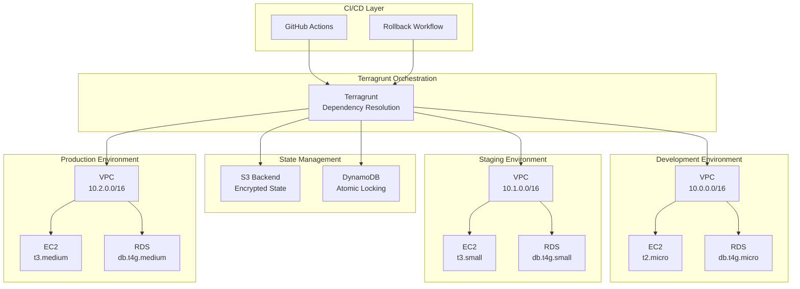
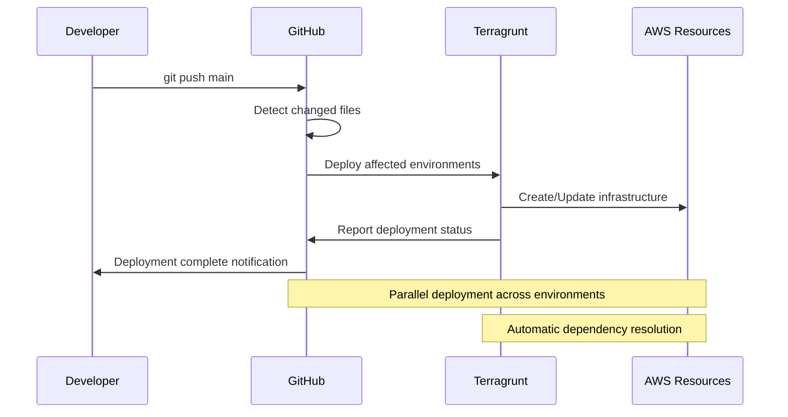
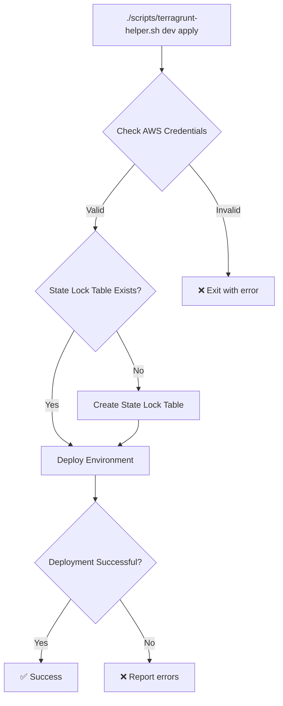

# Diagrams and Visual Assets for the Article

## 1. Before vs After Comparison Diagram

```mermaid
graph TD
    subgraph "BEFORE: Manual & Fragmented"
        A1[Developer] --> B1[cd vpc/]
        B1 --> C1[terragrunt apply]
        C1 --> D1[cd ../compute/]
        D1 --> E1[terragrunt apply]
        E1 --> F1[cd ../db/]
        F1 --> G1[terragrunt apply]
        G1 --> H1[Repeat for staging...]
        H1 --> I1[Repeat for prod...]

        J1[CI/CD] --> K1[Single resource deployment]
        K1 --> L1[30% failure rate]
        L1 --> M1[Manual intervention]
    end

    subgraph "AFTER: Automated & Streamlined"
        A2[Developer] --> B2[./scripts/terragrunt-helper.sh dev apply]
        B2 --> C2[All resources deployed]

        D2[CI/CD] --> E2[Smart change detection]
        E2 --> F2[Parallel deployment]
        F2 --> G2[<5% failure rate]
        G2 --> H2[Automated rollback]
    end
```



## 2. Architecture Overview



## 3. Cost Comparison Chart

| Environment | Before (Monthly) | After (Monthly) | Savings |
|-------------|------------------|-----------------|---------|
| Development | $85 | $22 | 74% |
| Staging | $120 | $41 | 66% |
| Production | $200 | $82 | 59% |
| **Total** | **$405** | **$145** | **64%** |

## 4. Performance Metrics

### Deployment Time Reduction
- Before: 45 minutes
- After: 12 minutes
- Improvement: 73% faster

### Success Rate Improvement
- Before: 70% success rate
- After: 95% success rate
- Improvement: 83% better reliability

### Operational Cost Reduction
- Before: 8 hours/week DevOps time
- After: 1 hour/week DevOps time
- Improvement: 87% reduction

## 5. Code Snippets for Visual Appeal

### Before (Problematic)
```hcl
# ❌ Unreliable state locking
remote_state {
  config = {
    use_lockfile = true  # Race conditions!
  }
}

# ❌ No mock outputs
dependency "vpc" {
  config_path = "../vpc"
  # Planning fails if VPC isn't deployed
}
```

### After (Optimized)
```hcl
# ✅ Production-grade locking
remote_state {
  backend = "s3"
  config = {
    dynamodb_table = "terraform-state-lock-table"
    encrypt        = true
  }
}

# ✅ Mock outputs for parallel development
dependency "vpc" {
  config_path = "../vpc"
  mock_outputs = {
    pub_subnet_id = "subnet-000000"
    vpc_sg        = "sg-000000"
  }
  mock_outputs_allowed_terraform_commands = ["validate", "plan", "destroy"]
}
```

## 6. Workflow Diagram



## 7. Helper Script Flow



## Image Assets Needed

1. **Hero Image**: Split-screen showing chaotic deployment vs streamlined process
2. **Architecture Diagram**: Clean visual of the multi-environment setup
3. **Metrics Dashboard**: Charts showing the performance improvements
4. **Cost Savings Graph**: Visual representation of cost reduction
5. **Workflow Illustration**: Step-by-step deployment process
6. **Before/After Code Comparison**: Side-by-side code screenshots